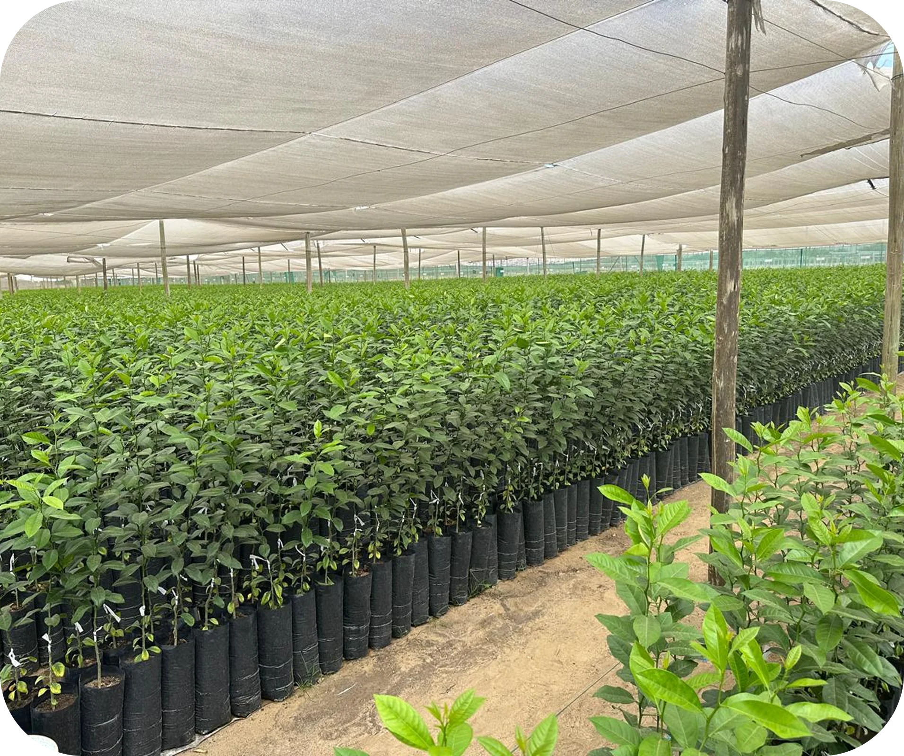
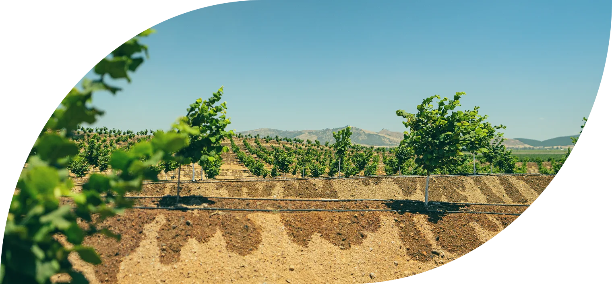

# ttagro.cl — Manual de implementación y verificación
**Auditoría técnica + guía de trabajo · Agosto 2026**
**Para: Paula López G.**

---

## Cómo usar este documento

Está ordenado **por tarea**, no por hallazgo. Cada tarea trae: qué hay que hacer, dónde, el código listo para pegar, y **cómo verificar tú misma que quedó bien** antes de darla por cerrada.

- **Parte 1** — Contexto en 3 minutos
- **Parte 2** — Tareas de implementación (13, priorizadas)
- **Parte 3** — Herramientas de verificación
- **Parte 4** — Checklist de cierre
- **Anexo** — Diagnóstico completo, por si quieres el detalle

No hace falta leer todo. Si tienes 5 minutos, anda a la Parte 2 y empieza por la Tarea 1.

> **El sitio pasó de 10 a 20 páginas el 17 de agosto de 2026**, al publicarse la versión en
> inglés (Tarea 11). Donde el documento diga "las 10 páginas", léase 10 en español. Las 10
> en inglés se clonaron de las españolas, así que **heredan todo lo ya cerrado**: H1 de
> escritorio, alt en imágenes, Open Graph, canonical y `lang`. Lo que sigue pendiente, sigue
> pendiente en los dos idiomas.

---

# PARTE 1 — Contexto en 3 minutos

## Lo que está bien y no hay que romper

El sitio tiene una virtud grande: **el contenido está en HTML plano y no depende de JavaScript**. Eso significa que Google y los crawlers de IA pueden leerlo. Es la parte difícil y ya está resuelta. Si en algún momento se migra a un framework con render diferido, se pierde — mantenerlo así es una decisión, no un accidente.

También están bien: los `<title>` y `meta description` (únicos y descriptivos en las 5 páginas), la arquitectura de 5 páginas, el uso de WebP, y la indexación (el sitio aparece primero al buscar "TerraTech Agro").

## El problema real

**El sitio se encuentra pero no se entiende.**

Cuando se le pregunta a Gemini "qué es Terra Tech Agro", responde describiendo **otra empresa**: una marca de fertilizantes de sílice registrada ante el SAG, distribuida en Chile. A nuestra empresa la menciona de pasada, descrita con el objeto social del Diario Oficial, no con lo que dice el sitio.

De las 4 fuentes que citó, **3 son de esa otra empresa** (incluido el LinkedIn de un ejecutivo de la importadora que la distribuye) y **ttagro.cl no aparece**.

La causa técnica es concreta: el sitio no entrega datos estructurados. No hay ninguna señal legible por máquina que diga "esta entidad es TERRATECH AGRO SpA, RUT tal, de Santiago, que hace esto". Sin eso, los buscadores arman la identidad de la empresa con lo que encuentran suelto por ahí — y lo que hay suelto es mayoritariamente de la competencia.

**Por eso la Tarea 1 es la más importante del documento.** No es una buena práctica: es correctiva.

## Score actual

**4.3 / 10.** Ejecutando las tareas 1 a 8 debería llegar a ~7.5.

---

# PARTE 2 — Tareas de implementación

Ordenadas por impacto. Las tareas 1 a 4 son las que mueven la aguja.

---

## 🗺️ TAREA 0 — Dos entornos distintos (leer antes que nada)
**No es una tarea: es el mapa que evita perder tiempo en el lugar equivocado**

Este proyecto vive en **dos lugares que no son el mismo sitio**, y confundirlos lleva a
conclusiones falsas — me pasó a mí en una versión anterior de este documento.

| | Previsualización de Paula | **Sitio real** |
|---|---|---|
| Dónde | Cloudflare Pages | Hosting del desarrollador |
| Servidor | Cloudflare | **LiteSpeed** (compatible con Apache) |
| URL | la de Cloudflare Pages | **https://ttagro.cl/** |
| Acceso | con usuario y contraseña | público, abierto |
| Quién publica | Paula, con cada cambio | el desarrollador, cuando recibe los archivos |

**El flujo de trabajo es: Paula edita → previsualiza en Cloudflare → le manda los archivos al
desarrollador → el desarrollador publica en ttagro.cl.**

### Qué implica esto en la práctica

**1. La contraseña de la previsualización no es un problema.**
`functions/_middleware.js` pide usuario y contraseña, pero **solo protege la previsualización
de Paula**, que es exactamente para lo que está. Se verificó que `https://ttagro.cl/`
responde `200` sin pedir nada: Google y los crawlers de IA entran sin problema.

**2. Hay archivos del repositorio que NO llegan al sitio real.**
Son específicos de Cloudflare y el hosting del desarrollador los ignora:

- `functions/_middleware.js` — la contraseña de la previsualización
- `_headers` — las reglas de caché de Cloudflare

En el sitio real, el equivalente de `_headers` se configura en `.htaccess`. Si las cabeceras
de caché importan en producción, hay que pedírselas al desarrollador aparte.

**3. Hay tareas que Paula no puede cerrar sola.** Requieren acceso al servidor:
Tarea 6.4 (redirecciones 301) y, en parte, la Tarea 7 (subir los archivos a la raíz).
Están marcadas más abajo.

### ✅ Lo bueno: lo publicado está al día

Se comparó el HTML de `https://ttagro.cl/` con la última versión del repositorio:
**son idénticos byte a byte** (22.317 bytes, misma fecha). O sea que lo auditado es
exactamente lo que está publicado, y el circuito Paula → desarrollador está funcionando.

---

## 🟡 TAREA 1 — Datos estructurados (Schema.org) — **VERSIÓN PARCIAL IMPLEMENTADA** (17 ago 2026)
**Impacto: máximo · Dificultad: baja**

> **Decisión del 17 de agosto de 2026: se implementó la versión parcial descrita más abajo,
> sin esperar al LinkedIn.**
>
> El sitio pasó de **cero datos estructurados** a declarar la identidad de la empresa con
> todo lo que ya es público. Faltan tres campos —RUT, `contactPoint` y `sameAs`— que se
> agregan después sin rehacer nada.

### Qué quedó implementado

Un bloque `Organization` en las **20 páginas** (10 en español + 10 en inglés, escritorio y
móvil), más un `AboutPage` con el equipo en las cuatro versiones de *Nosotros*. Son 24
bloques JSON-LD en total, todos validados.

**Va también en `/web-mobile/`, y eso es deliberado.** La Tarea 6 demostró que Google rastrea
con *mobile-first* y que `version.js` lo manda ahí. Si el schema viviera solo en las páginas
de escritorio, el rastreador podría no verlo nunca. El plan original de esta tarea decía "las
5 páginas" y arrastraba el mismo punto ciego que la Tarea 2 (ver Tarea 13).

| Campo | Estado |
|---|---|
| `name`, `legalName`, `alternateName` | ✅ Puesto |
| `address` | ✅ Puesto (el del pie de página) |
| `description` con la negación de fertilizantes | ✅ Puesto — es la parte que desambigua |
| `knowsAbout`, `areaServed` | ✅ Puesto |
| `url`, `logo`, `image` | ✅ Puesto |
| `AboutPage` con las 8 personas del equipo | ✅ Puesto |
| `sameAs` (LinkedIn) | ✅ **Puesto el 17 ago** — era el que más pesaba |
| `identifier` (RUT) | ⏳ Falta |
| `contactPoint` (teléfono, email) | ⏳ Falta |

### `sameAs` — resuelto el mismo día

`https://www.linkedin.com/company/terratech-agro/` — comprobado que responde `200` antes de
declararlo. Es el campo que el manual daba por más importante: le permite a un buscador
**confirmar** la entidad cruzando una fuente independiente, en vez de solo creerle al sitio.

Para que rinda al máximo falta una cosa que no es código: **que las 8 personas del equipo
declaren la empresa como empleador en sus perfiles de LinkedIn.** Eso convierte una fuente en
nueve que se respaldan entre sí.

### ⚠️ Los campos que faltan se OMITEN, no se ponen con datos de ejemplo

El código de más abajo trae `"value": "XX.XXX.XXX-X"` y `contacto@ttagro.cl`. **Nada de eso
se publicó.** Publicar un RUT inventado o un correo que no existe es peor que no declarar
nada: Google intenta verificarlo, falla, y la señal de identidad queda dañada justo en lo que
esta tarea viene a arreglar.

Los dos campos están anotados en un comentario dentro del HTML de cada página, para que quien
los tenga sepa dónde van.

### Lo que falta para cerrarla del todo

1. ✅ ~~Página de LinkedIn de empresa~~ — **hecho el 17 de agosto de 2026.** Queda el paso
   humano: que el equipo la declare como empleador en sus perfiles.
2. **Email corporativo** (`contacto@ttagro.cl` o similar). Ver también la Tarea 8: hoy el
   formulario de contacto llega a un correo personal.
3. **Teléfono de la empresa**, si se decide publicar uno.
4. **RUT de la sociedad** — es público (está en el Diario Oficial) y es el desambiguador
   definitivo: ninguna otra Terra Tech del mundo comparte el RUT.

### ✅ El ícono de LinkedIn en el pie — hecho (17 ago 2026)

Ahora que el perfil existe, el pie lo enlaza. Es un enlace visible que refuerza lo que declara
el `sameAs`: una cosa es decir "este es nuestro LinkedIn" en metadata, otra es enlazarlo de
verdad desde todas las páginas.

Los íconos de redes estaban en el HTML **comentados** desde antes. Se descomentaron dejando
**solo LinkedIn**: Instagram y X salieron, porque esos perfiles no existen y un ícono que
lleva a ninguna parte resta más de lo que suma.

| Dónde | Ícono |
|---|---|
| Pie oscuro (Inicio, escritorio y móvil) | `assets/png/social-li-claro.png` |
| Pie claro (las otras 4, escritorio y móvil) | `assets/png/social-li-gris.png` |

**Escritorio y móvil usan el mismo archivo.** El móvil traía un SVG dibujado a mano que no
coincidía con el ícono del diseño; se reemplazó por el PNG, que las páginas móviles cargan
desde `../assets/png/` igual que ya cargaban las fotos del equipo. En `mobile.css` la regla
`.foot .social a svg` pasó a ser `.foot .social a img`.

Los enlaces llevan `target="_blank"` y `rel="noopener"`, y un `aria-label` descriptivo en cada
idioma ("TerraTech Agro en LinkedIn" / "on LinkedIn") en vez del escueto "LinkedIn" que tenían.

### Nota sobre `foundingDate`

El código de ejemplo traía `"foundingDate": "2026"`. **No se publicó**, porque no está
verificado y además choca con lo que dice el propio sitio: "+25 años de alianzas y proveedores
estratégicos". Si la SpA se constituyó en 2026 pero el equipo arrastra 25 años de relaciones,
son dos cosas distintas y conviene declarar la correcta. Está en el Diario Oficial.

---

### Contexto original de la tarea (11 de agosto)

> La empresa **no tenía** teléfono ni email corporativos —solo personales— ni página
> de LinkedIn. Publicar datos personales de alguien del equipo como si fueran de contacto
> corporativo no corresponde, así que se esperó.

### Por qué esperar tiene sentido acá

El campo que más pesa en esta tarea es `sameAs`, donde van los perfiles verificados de la
empresa. Es lo que le permite a un buscador **confirmar** que la entidad existe cruzando
fuentes independientes. Un schema sin `sameAs` declara quiénes somos, pero no lo respalda
con nada.

Como el problema que esta tarea viene a resolver es de **identidad** —que nos confundan con
otra empresa—, hacerla a medias rinde bastante menos que hacerla completa una vez.

### Se puede hacer una versión parcial cuando se quiera

Si en algún momento conviene no seguir esperando, **la tarea se puede implementar hoy** con
lo que ya es público en el sitio, y agregarle los campos que faltan después sin rehacer nada:

| Campo | ¿Se puede hoy? |
|---|---|
| `name`, `legalName`, `alternateName` | ✅ Sí |
| `address` (Isidora Goyenechea 3162) | ✅ Sí, ya está publicada en el pie |
| `description` con la negación de fertilizantes | ✅ Sí — es la parte que desambigua |
| `knowsAbout` (áreas de expertise) | ✅ Sí |
| `url`, `logo` | ✅ Sí |
| `identifier` (RUT) | ⏳ Falta |
| `contactPoint` (teléfono, email) | ⏳ Falta |
| `sameAs` (LinkedIn) | ⏳ Falta — el más importante |

Eso ya sería pasar de **cero datos estructurados** a la mayor parte del beneficio.

### Lo que hay que conseguir antes

1. **Página de LinkedIn de empresa** — la señal más fuerte. Idealmente, que las 8 personas
   del equipo la declaren como empleador en sus perfiles.
2. **Email corporativo** (`contacto@ttagro.cl` o similar). Ver también la Tarea 8: hoy el
   formulario de contacto llega a un correo personal.
3. **Teléfono de la empresa**, si se decide publicar uno.
4. **RUT de la sociedad** — es público (está en el Diario Oficial) y es el desambiguador
   definitivo: ninguna otra Terra Tech del mundo comparte el RUT.

### Código (para cuando estén los datos)

### Código

```html
<script type="application/ld+json">
{
  "@context": "https://schema.org",
  "@type": "Organization",
  "@id": "https://ttagro.cl/#organization",
  "name": "TerraTech Agro",
  "legalName": "TERRATECH AGRO SpA",
  "alternateName": ["TT Agro", "TTAGRO"],
  "url": "https://ttagro.cl/",
  "logo": "https://ttagro.cl/assets/logo.svg",
  "description": "Gestora agroindustrial chilena que diseña, implementa y opera proyectos agrícolas sustentables bajo criterios ESG, con gestión hídrica trazable y orientación al mercado agroexportador. No fabrica ni comercializa fertilizantes ni insumos agrícolas.",
  "foundingDate": "2026",
  "identifier": {
    "@type": "PropertyValue",
    "propertyID": "RUT",
    "value": "XX.XXX.XXX-X"
  },
  "address": {
    "@type": "PostalAddress",
    "streetAddress": "Isidora Goyenechea 3162, Oficina 902",
    "addressLocality": "Las Condes",
    "addressRegion": "Región Metropolitana",
    "postalCode": "7550000",
    "addressCountry": "CL"
  },
  "contactPoint": [{
    "@type": "ContactPoint",
    "contactType": "customer service",
    "email": "contacto@ttagro.cl",
    "telephone": "+56-2-XXXXXXXX",
    "areaServed": ["CL", "PE"],
    "availableLanguage": ["Spanish", "English"]
  }],
  "knowsAbout": [
    "Gestión hídrica agrícola",
    "Criterios ESG en agricultura",
    "Agroexportación",
    "Trazabilidad agrícola",
    "Habilitación de predios",
    "GLOBALG.A.P."
  ],
  "sameAs": [
    "https://www.linkedin.com/company/terratech-agro",
    "https://www.instagram.com/ttagro"
  ]
}
</script>
```

### Por qué cada campo importa
- **`legalName`** — conecta el sitio con la razón social del Diario Oficial, que es lo que los buscadores ya conocen
- **`alternateName`** — Gemini ya usa "TT AGRO"; declararlo evita que lo trate como otra empresa
- **`identifier` / RUT** — el desambiguador definitivo. Ninguna otra Terra Tech del mundo comparte nuestro RUT
- **`sameAs`** — cada perfil verificado refuerza la identidad. Es el campo clave; no lo dejes vacío
- **La negación en `description`** ("no fabrica ni comercializa fertilizantes") es deliberada, para separarnos de la otra Terra Tech

### Extra en `/nosotros.html`
Además del bloque anterior, agrega:

```html
<script type="application/ld+json">
{
  "@context": "https://schema.org",
  "@type": "AboutPage",
  "mainEntity": { "@id": "https://ttagro.cl/#organization" },
  "about": {
    "@type": "Organization",
    "@id": "https://ttagro.cl/#organization",
    "employee": [
      { "@type": "Person", "name": "Michael Grasty C.", "jobTitle": "Presidente" },
      { "@type": "Person", "name": "Germán Wielandt N.", "jobTitle": "Vicepresidente Ejecutivo" },
      { "@type": "Person", "name": "Tomás Bottiger M.", "jobTitle": "Director" },
      { "@type": "Person", "name": "Fernando Cisternas L.", "jobTitle": "Director" },
      { "@type": "Person", "name": "Isabel Quiroz", "jobTitle": "Directora" },
      { "@type": "Person", "name": "Pedro Barros O.", "jobTitle": "Ejecutivo Control de Gestión" }
    ]
  }
}
</script>
```

### ✅ Cómo verificar
1. Ir a `https://validator.schema.org`, pegar la URL
2. Debe aparecer `Organization` sin errores en rojo
3. Hacer clic en cada URL de `sameAs` — todas deben abrir
4. Repetir con las 5 páginas

---

## ✅ TAREA 2 — H1 y jerarquía de encabezados — **SOLUCIONADO**
**Impacto: alto · Dificultad: baja · Tiempo: 30 min · Implementado: 10 ago 2026**

### El problema
**3 de las 5 páginas no tienen H1.** El H1 es la señal más fuerte de "de qué trata esta página". En `proyectos.html`, "Sur Andina" —nuestro único caso documentado— no está marcado como encabezado en ningún nivel.

| Página | Estado inicial | Estado final |
|---|---|---|
| `index.html` | ✅ Tiene H1, pero salta de H1 a **H4** | ✅ H1→H2→H3, sin saltos |
| `nosotros.html` | ❌ Sin H1 | ✅ H1 "Nosotros" |
| `que-hacemos.html` | ✅ Correcto | ✅ Sin cambios |
| `proyectos.html` | ❌ Sin H1 | ✅ H1 "Sur Andina" |
| `contacto.html` | ❌ Sin H1 | ✅ H1 "Estamos para ayudarte" |

### Cómo se implementó
Los "chips" verdes (`<span class="chip">`) pasaron a ser encabezados reales manteniendo
**exactamente el mismo aspecto visual**. Se agregó `font-weight: 400` a `.chip` en
`styles.css` para que un `<h2>` no se viera en negrita.

| Archivo | Cambio |
|---|---|
| `index.html` | chips "Nuestro enfoque", "Pilares bajo criterios ESG" y "Experiencia" → `<h2>`; los 3 `<h4 class="ps-heading">` (Medio Ambiente / Social / Gobernanza) → `<h3>`, que era el salto H1→H4 |
| `nosotros.html` | chip "Nosotros" → `<h1>`; "Misión" y "Visión" → `<h2>`; "Equipo" → `<h2>`; "Asesorías técnicas externas" → `<h3>` |
| `proyectos.html` | chip "Sur Andina" → `<h1>` |
| `contacto.html` | chip "Estamos para ayudarte" → `<h1>`; los `<h2>` del formulario ya estaban bien. Se corrigió la tilde de "Área de contacto" |
| Las 5 | footer: `<h3>` → `<p class="footer-title">` |
| `styles.css` | `.chip` con `font-weight: 400`; selector `.footer-title` agregado junto a `.footer-col h3` |

**Verificado:** las 5 páginas dan exactamente 1 H1, sin saltos de nivel, y las capturas
de pantalla antes/después son idénticas.

### ⚠️ Pendiente de decisión de contenido (no técnico)
Se conservó el texto visible tal cual para no alterar el diseño. Dos H1 quedaron con
texto poco descriptivo para buscadores:

- `contacto.html` → H1 dice "Estamos para ayudarte". Sería más fuerte "Contacto" o
  "Contacta a TerraTech Agro".
- `proyectos.html` → H1 dice "Sur Andina". Correcto para el proyecto, pero la página
  se llama "Proyectos". Alternativa: "Sur Andina — 500 hectáreas en Olmos, Perú".

Son cambios de **copy visible**, así que quedan a decisión de marketing.

### Código

```html
<!-- nosotros.html -->
<h1>Nosotros</h1>
  <h2>Misión</h2>
  <h2>Visión</h2>
  <h2>Equipo</h2>
    <h3>Directorio y ejecutivos</h3>
    <h3>Asesorías técnicas externas</h3>

<!-- proyectos.html -->
<h1>Proyectos</h1>
  <h2>Sur Andina — 500 hectáreas en Olmos, Perú</h2>

<!-- contacto.html -->
<h1>Contacto</h1>
  <h2>Datos personales</h2>
  <h2>Área de contacto</h2>

<!-- index.html: corregir el salto H1 → H4 -->
<h1>Gestión trazable para una agricultura sostenible</h1>
  <h2>Nuestro enfoque</h2>
  <h2>Pilares bajo criterios ESG</h2>
    <h3>Medio Ambiente</h3>
    <h3>Social</h3>
    <h3>Gobernanza</h3>
  <h2>Experiencia</h2>
```

### Ojo con el footer — ✅ hecho
"Dirección", "Explorar" y "Ayuda" eran `<h3>` y ahora son `<p class="footer-title">` en las
5 páginas — ya no compiten con la jerarquía del contenido principal.

> **Nota:** las páginas de `web-mobile/` todavía usan `<h3>` en su footer. El CSS mantiene
> los dos selectores a propósito, así que no se rompe nada; queda pendiente migrarlas.

### Regla
**Exactamente un H1 por página. Nunca saltar niveles** (no pasar de H1 a H4). Los encabezados son estructura semántica, no tamaño de letra: si necesitas que algo se vea más chico, usa CSS.

### ✅ Cómo verificar
`Ctrl+U` en cada página → `Ctrl+F` buscando `<h1` → debe decir **1/1**. Luego `<h2`, `<h3` para confirmar que no hay saltos.

---

## 🟠 TAREA 3 — Arreglar lo que está roto — **2 de 3 cerradas**
**Impacto: alto · Dificultad: baja · Tiempo: 30 min**

Tres bugs que quedaron del desarrollo:

| Sub-tarea | Estado |
|---|---|
| 3.1 CTA sin texto | ✅ Ya estaba correcto antes de empezar |
| 3.2 Imágenes con `src` vacío | ⚠️ No es el bug que se creía — pasa a la Tarea 4 |
| 3.3 Carpeta con espacio | ✅ Solucionado el 11 ago 2026 |

### 3.1 — CTA sin texto en la home — ✅ **YA ESTABA SOLUCIONADO**
El manual reportaba un botón cuyo texto visible era literalmente `#nosotros`. Al revisar el
código actual, ese enlace ya no tiene texto suelto: es la flecha de "bajar" del hero, con
ícono SVG y etiqueta accesible correcta.

```html
<!-- Estado actual en index.html — correcto -->
<a class="scroll-hint" href="#nosotros" aria-label="Bajar">
  <svg viewBox="0 0 30 16" aria-hidden="true">…</svg>
</a>
```

No requiere acción.

### 3.2 — Imágenes con `src` vacío — ⚠️ **MATIZADO**
Existen 4 ``: dos en `proyectos.html` (el slider de Sur Andina) y dos en
`index.html` (la galería del modal de Experiencia).

**No son un bug**: son contenedores que JavaScript rellena al cargar la página, así que el
visitante siempre ve la foto y **no se produce ningún error 404 en consola**.

El problema real es distinto y más de fondo: **un crawler que no ejecuta JavaScript no ve
ninguna de esas fotos**. Justo en la página que demuestra que la empresa ejecutó obra real,
Google e IA no encuentran ni una imagen. La corrección no es "poner la ruta que falta", sino
que la primera foto venga ya escrita en el HTML y JS solo cambie las siguientes.

Se aborda junto con la Tarea 4.

### 3.3 — Carpeta con espacio en el nombre — ✅ **SOLUCIONADO** (11 ago 2026)
Las fotos del equipo estaban en `/fotos equipo/`. El espacio obliga a codificación `%20`,
rompe cachés y CDNs, y falla de forma impredecible en algunos crawlers.

Se movieron a `/assets/equipo/` con el nombre completo de cada persona, que además ayuda al
SEO de imágenes:

| Antes | Ahora |
|---|---|
| `fotos equipo/michael.webp` | `assets/equipo/michael-grasty.webp` |
| `fotos equipo/tomas.webp` | `assets/equipo/tomas-bottiger.webp` |
| `fotos equipo/german.webp` | `assets/equipo/german-wielandt.webp` |
| `fotos equipo/fernando.webp` | `assets/equipo/fernando-cisternas.webp` |
| `fotos equipo/isabel.webp` | `assets/equipo/isabel-quiroz.webp` |
| `fotos equipo/pedro.webp` | `assets/equipo/pedro-barros.webp` |
| `fotos equipo/paula.webp` | `assets/equipo/paula-lopez.webp` |
| `fotos equipo/rafael.webp` | `assets/equipo/rafael-guerrero.webp` |
| `fotos equipo/francisco.webp` | `assets/equipo/francisco-garcia-huidobro.webp` |
| `fotos equipo/cristian.webp` | `assets/equipo/cristian-cobo.webp` |

Se usó `git mv`, así que el historial de cada foto se conserva.

**Archivos actualizados además del renombrado:**

- `nosotros.html` — las 11 rutas
- `_headers` — tenía una regla de caché para `/fotos equipo/*` que ya no servía de nada;
  ahora las cubre la regla de `/assets/*`
- `web-mobile/nosotros.html` — ver más abajo
- `_ingles-standby/nosotros-en.html` — ver más abajo

### 3.4 — Hallazgos nuevos durante esta tarea

**a) Las fotos estaban duplicadas — 776 KB de más**
`web-mobile/assets/equipo/` tenía **una copia byte a byte** de las mismas 12 fotos. Se
verificó con `shasum`: idénticas. Se eliminó la copia y `web-mobile/nosotros.html` ahora
apunta a `../assets/equipo/`. Una sola carpeta de fotos para todo el sitio.

> Esto importa más de lo que parece: `web-mobile/` es lo que ven los celulares (`version.js`
> los redirige ahí), y **Google usa la versión móvil para posicionar**.

**b) Las páginas en inglés tenían las rutas rotas desde antes**
`_ingles-standby/nosotros-en.html` apuntaba a `fotos equipo/…`, ruta relativa que se resolvía
a `_ingles-standby/fotos equipo/` — **una carpeta que nunca existió**. Ninguna foto cargaba.
No lo causó esta tarea; ya estaba así. Quedó corregido a `../assets/equipo/…` para cuando se
lance la versión en inglés (Tarea 11).

**c) Se usaron rutas relativas (`../assets/`), no absolutas (`/assets/`)**
A propósito: el equipo abre archivos localmente con `file://` —hay comentarios en el código
que lo confirman— y una ruta absoluta se rompe en ese modo.

### ⚠️ Pendiente menor: 3,9 MB de PNG sin usar
En la carpeta había tres PNG originales que **ninguna página usa**, pero que sí se publican
y pesan 3,9 MB: `pedro-barros-original.png`, `rafael-guerrero-original.png` y
`manuel-palacios-original.png` (este último también tenía un espacio en el nombre).

Se conservaron y se les normalizó el nombre, pero conviene decidir: si son los originales de
respaldo, deberían salir del repositorio (a Drive, por ejemplo) para no viajar en cada deploy.

### ✅ Cómo verificar
`F12` → pestaña **Console** → recargar con `Ctrl+R`. No debe haber líneas rojas ni errores 404.
Luego pestaña **Network** → filtro **Img** → recargar → todas las filas en `200`.

---

## ✅ TAREA 4 — Texto alternativo en imágenes — **SOLUCIONADO**
**Impacto: alto · Dificultad: media · Implementado: 11 ago 2026**

### Lo que se hizo

Se revisaron las **77 imágenes** del sitio (5 páginas de escritorio + 5 de móvil). Resultado:
**0 imágenes sin atributo `alt`** en todo el sitio.

| Grupo | Qué se hizo |
|---|---|
| 11 fotos del equipo (escritorio) | `alt` con nombre **+ cargo + empresa**, `width`/`height`, `loading="lazy"` bajo el pliegue |
| 11 fotos del equipo (móvil) | Lo mismo, para que coincidan |
| 10 logos de aliados (escritorio) | `alt`, `width`/`height`, `loading="lazy"` |
| 10 logos de aliados (móvil) | Lo mismo |
| 18 imágenes de pilares ESG | `loading="lazy"` (792 KB bajo el pliegue). El `alt=""` se **mantuvo a propósito** — ver abajo |
| Foto de Sur Andina | Ahora viene en el HTML, con `alt` descriptivo. Escritorio y móvil |
| 4 logos del header móvil | `width`/`height` |

**Sobre el `alt` de las personas:** pasó de `"Michael Grasty C."` a
`"Michael Grasty C., Presidente de TerraTech Agro"`. No es solo accesibilidad — cada foto
ahora asocia explícitamente a una persona con la empresa, que es exactamente el tipo de señal
que necesita la Tarea 1 para desambiguar la marca frente a la otra Terra Tech.

---

### ⚠️ Dos correcciones al diagnóstico original

**1. "Casi todas las imágenes tienen `alt` vacío" — inexacto**
Ninguna imagen carecía del atributo. Las fotos del equipo ya traían el nombre de la persona.
Las que tenían `alt=""` eran las de los pilares ESG, y en ese caso **es lo correcto**.

**2. "Las imágenes ESG aparecen duplicadas, cada archivo se carga dos veces" — FALSO**

Se midió con un servidor que registra cada petición HTTP:

```
/assets/ma-main.webp      1 petición
/assets/ma-left.webp      1 petición
/assets/social-main.webp  1 petición
…  (9 archivos, 1 petición cada uno)
```

Sí aparecen **dos etiquetas `` por archivo**, pero el navegador descarga una URL
idéntica **una sola vez**. La segunda etiqueta es la copia teñida (`filter:url(#tintDark)`)
que produce la animación de color del isotipo. **Borrarla rompería el diseño sin ahorrar un
solo byte.** No se tocó.

---

### Por qué el `alt=""` de los pilares ESG se mantuvo

Seguir aquí el consejo del manual habría **empeorado** la accesibilidad. Esas 18 imágenes son
formas decorativas de una hoja: el contenido real ya está en el `<h3>` y la lista de cada
pilar, que son texto de verdad y sí los lee Google.

Ponerles `alt` descriptivo haría que un lector de pantalla anunciara **seis descripciones
redundantes por pilar** antes de llegar al texto útil. La regla del propio manual aplica:
*"`alt=""` solo en imágenes puramente decorativas"* — y estas lo son.

---

### El problema real que sí había: la página de Proyectos era invisible

Este es el hallazgo de fondo de la tarea, y no estaba descrito así en el diagnóstico.

`proyectos.html` no tenía **ninguna** imagen en el HTML: el slider se llenaba entero desde
JavaScript. Un crawler que no ejecuta JS —que son casi todos los de IA— veía la página que
demuestra que la empresa ejecutó obra real **sin una sola foto**.

Se corrigió poniendo la primera foto directamente en el HTML:

```html

```

Y `script.js` se ajustó para **respetarla** en vez de pisarla (`if (!pA.getAttribute('src'))`),
sin descarga extra. El `alt` que asigna al pasar de foto también mejoró: ahora dice
*"Sur Andina, Olmos (Perú) — foto 3 de 9"* en vez de solo *"foto 3 de 9"*.

**Verificado:** con JavaScript desactivado en el navegador, la foto de Sur Andina se sigue
viendo. Eso es lo que ve Google.

---

### ⚠️ Pendientes de esta tarea

- **Los logos de aliados dicen `alt="Logo de empresa aliada de TerraTech Agro"`** — genérico,
  porque no sabemos qué empresas son. Si me pasas los nombres, el `alt` correcto sería el
  nombre de cada empresa, que además refuerza las alianzas ante buscadores.
- **`loading="lazy"` está puesto pero no se pudo demostrar el ahorro localmente.** Chrome, en
  una conexión local rápida, igual descargó las imágenes ESG por adelantado (su umbral es
  generoso). El beneficio aparece en conexiones móviles reales, que es donde importa. No lo
  cuento como victoria medida.
- **`assets/ma-main.webp` pesa 186 KB**, bastante para una hoja decorativa. Comprimir los 9
  assets ESG es material de la Tarea 12.
- **La foto del hero es un `background` de CSS, no un ``.** El consejo del manual
  (`fetchpriority="high"` en el hero) no se puede aplicar tal cual; requiere un
  `<link rel="preload">`. Queda para la Tarea 12.

---

### El diagnóstico original decía:

### Código

```html
<!-- Mal -->


<!-- Bien -->


<!-- Imagen del hero (la primera visible): NO uses lazy -->

```

### Reglas
- Describe **qué muestra** la imagen, no repitas el nombre del archivo
- `alt=""` **solo** en imágenes puramente decorativas
- Siempre `width` y `height` explícitos → evita que la página "salte" al cargar (mejora el CLS)
- `loading="lazy"` en todo **menos** en las imágenes visibles al abrir la página
- ~~Elimina la duplicación de assets ESG~~ → **no aplica, ver arriba: no había duplicación**

### ✅ Cómo verificar
`https://wave.webaim.org` → pegar URL. Marca visualmente cada imagen sin alt.
O `pagespeed.web.dev` → sección Accesibilidad → las lista una por una.

---

## ✅ TAREA 5 — Open Graph y Twitter Cards — **SOLUCIONADO** (11 ago 2026)
**Impacto: alto · Dificultad: baja · Implementado con imagen provisional**

### El problema
Al compartir ttagro.cl en LinkedIn o WhatsApp aparece un link pelado, sin imagen ni
descripción. En B2B, que es exactamente cómo circula este sitio, eso mata el click.

### Qué se hizo

Las **14 etiquetas** de Open Graph y Twitter Card quedaron puestas en las **10 páginas**
(5 de escritorio + 5 de móvil), con título y descripción propios de cada una.

**Un detalle que importa:** en las páginas móviles, `og:url` apunta a la URL **de escritorio**,
no a la de `/web-mobile/`. Así, cuando alguien comparte el sitio desde su celular, el enlace
que circula es el canónico. Sin ese cuidado, se repartirían por WhatsApp enlaces a
`/web-mobile/` que ensuciarían justo lo que arregló la Tarea 6.

**Verificado:** las 10 páginas tienen las 14 etiquetas, y en las 10 el `og:url` coincide
exactamente con el `canonical`.

### 🎨 La imagen: hay una provisional, falta la definitiva

El manual pedía diseñar `og-image.jpg` de 1200 × 630. Como sin imagen el enlace igual sale
pelado —que es justo lo que se quería evitar— **se generó una provisional** y ya está en
`assets/og-image.jpg` (1200 × 630, JPG, 176 KB).

Está construida **solo con material que ya existía en el sitio**: la foto aérea del hero,
el logo claro, la tipografía Batica Sans y los colores de marca (verde `#043120`, amarillo
`#f4df57`, verde claro `#7BC250`). No se inventó nada nuevo.

Lleva el titular del hero —*"Gestión trazable para una agricultura sostenible"*— con
"sostenible" en amarillo, y abajo *"Proyectos agrícolas bajo criterios ESG · Chile y Perú"*,
que agrega los dos países. El texto es grande a propósito: tiene que leerse en la miniatura
de un chat.

> **Sigue siendo un reemplazo, no la versión final.** Cuando diseño entregue la definitiva,
> basta con sobrescribir `assets/og-image.jpg` respetando los 1200 × 630 px. **No hay que
> tocar ni una línea de HTML**, porque las 10 páginas ya apuntan a esa ruta.

### Cómo verificar cuando esté publicado

Las herramientas de previsualización necesitan que la página sea pública, así que esto solo
se puede comprobar **después** de que el desarrollador publique:

1. `https://www.opengraph.xyz` → pegar la URL
2. La prueba real: pegarte el link a ti misma por WhatsApp
3. LinkedIn: `https://www.linkedin.com/post-inspector/` — además fuerza a refrescar su caché,
   necesario si LinkedIn ya guardó el enlace sin imagen

### Código
En el `<head>` de cada página, con valores propios por página:

```html
<meta property="og:type" content="website">
<meta property="og:locale" content="es_CL">
<meta property="og:site_name" content="TerraTech Agro">
<meta property="og:url" content="https://ttagro.cl/">
<meta property="og:title" content="TerraTech Agro — Gestión trazable para una agricultura sostenible">
<meta property="og:description" content="Empresa gestora de proyectos agrícolas sustentables. Diseñamos, implementamos y operamos proyectos agrícolas bajo criterios ESG.">
<meta property="og:image" content="https://ttagro.cl/assets/og-image.jpg">
<meta property="og:image:width" content="1200">
<meta property="og:image:height" content="630">
<meta property="og:image:alt" content="TerraTech Agro — gestión agroindustrial sustentable">

<meta name="twitter:card" content="summary_large_image">
<meta name="twitter:title" content="TerraTech Agro — Gestión trazable para una agricultura sostenible">
<meta name="twitter:description" content="Empresa gestora de proyectos agrícolas sustentables bajo criterios ESG.">
<meta name="twitter:image" content="https://ttagro.cl/assets/og-image.jpg">
```

### ✅ Cómo verificar
1. `https://www.opengraph.xyz` → pegar URL → ver la previsualización
2. Prueba real: pegar el link en un chat de WhatsApp contigo misma
3. Para LinkedIn: `https://www.linkedin.com/post-inspector/` — además fuerza a refrescar su caché

---

## 🟠 TAREA 6 — Canonical, idioma y redirecciones — **6.1 a 6.3 hechas · 6.4 al desarrollador**
**Impacto: alto · Dificultad: media · Implementado: 11 ago 2026**

### 🔴 Primero: el hallazgo que cambia esta tarea

La auditoría original revisó **solo las 5 páginas de escritorio**. Pero el sitio tiene
**10 páginas publicadas**, no 5: existe una versión móvil completa en `/web-mobile/`, y
`version.js` manda ahí a todo visitante que entre desde un celular.

**El problema:** Google rastrea con *mobile-first*, es decir, con un user-agent de celular.
Ese user-agent contiene la palabra "Android", que es exactamente lo que `version.js` busca
para redirigir. Y Google **sí ejecuta JavaScript**.

> Se comprobó: la expresión de `version.js` aplicada al user-agent real de Googlebot móvil
> devuelve `true`. Google termina en `/web-mobile/`.

O sea que **las páginas que Google estaba evaluando para posicionar eran las móviles**, y
estaban en peor estado que las de escritorio:

| Problema en `/web-mobile/` | Consecuencia |
|---|---|
| Título `"TerraTech Agro — Nosotros (móvil)"` | **"(móvil)" aparecería tal cual en los resultados de Google** |
| Ninguna tenía `meta description` | Google inventa el resumen del resultado |
| Ninguna tenía `canonical` | 10 URLs con el mismo contenido y ninguna señal de cuál vale |

Sumado a las 4 variantes de dominio sin redirección (6.4), el contenido del sitio estaba
repartido en más de una docena de URLs sin que nada indicara cuál era la buena.

### Qué se hizo

**En las 5 páginas de escritorio:**
```html
<html lang="es-CL">
<link rel="canonical" href="https://ttagro.cl/nosotros.html">
<link rel="alternate" media="only screen and (max-width: 820px)"
      href="https://ttagro.cl/web-mobile/nosotros.html">
```

**En las 5 páginas móviles:**
```html
<html lang="es-CL">
<title>Nosotros — TerraTech Agro</title>          <!-- se quitó el "(móvil)" -->
<meta name="description" content="…">             <!-- no tenían -->
<link rel="canonical" href="https://ttagro.cl/nosotros.html">
```

Ese par `canonical` + `alternate` es la forma estándar de declarar un sitio móvil en URL
aparte: le dice a Google **"son la misma página: indexa la de escritorio, sirve la móvil a
los celulares"**. Sin las dos etiquetas, la relación no se entiende.

### 6.5 — Páginas que no debían ser públicas (hallazgo nuevo)

Se detectó que hay archivos de trabajo publicados y rastreables en el sitio real:

| Archivo | Estado |
|---|---|
| `web-mobile/_proto-proyectos-A/B/C.html` | 200 — prototipos de diseño |
| `web-mobile/_prototipo-galeria.html` | 200 — prototipo |
| ~~`_ingles-standby/*.html` (5)~~ | ~~200 — versión en inglés **sin terminar**~~ |

Las de inglés eran las más delicadas: estaban a medio hacer, con los enlaces del menú
apuntando a las páginas en español. Si Google las indexaba, un comprador internacional podía
aterrizar en una página rota.

Se les agregó a las 9 páginas:
```html
<meta name="robots" content="noindex, nofollow">
```

> **Actualización 17 ago 2026 —** `_ingles-standby/` **ya no existe**. Al publicar la versión
> en inglés (Tarea 11) las páginas se regeneraron desde cero y la carpeta se borró, así que
> este `noindex` hoy solo aplica a los 4 prototipos. Nada quedó publicado a medio hacer.

Es la solución definitiva: `robots.txt` (Tarea 7) impide el rastreo, pero una página
bloqueada ahí igual puede aparecer en resultados si alguien la enlaza. `noindex` no.

### 6.1 — Idioma declarado ✅
Las 10 páginas pasaron de `lang="es"` a `lang="es-CL"`. Las de `_ingles-standby/` ya
declaraban `lang="en"` correctamente.

### 6.2 — Canonical en cada página ✅
**Verificado:** las 10 páginas tienen exactamente 1 `canonical`, 1 `title` y
1 `meta description`, y el navegador las interpreta bien.

### 6.3 — Unificar enlaces internos — ⚠️ **hecho distinto a lo que decía el manual**

El manual pedía que todos los enlaces internos apuntaran a `https://ttagro.cl/`. **No se hizo
así, a propósito**, porque romperia el flujo de trabajo: con enlaces absolutos, al hacer clic
en "Inicio" dentro de la previsualización de Cloudflare, Paula saltaría al sitio publicado sin
darse cuenta, y estaría revisando la versión antigua creyendo que ve sus cambios.

Los enlaces siguen siendo relativos (`index.html`). El problema que el manual quería resolver
—que `/` y `/index.html` sean dos URLs distintas— **queda igualmente resuelto** por dos vías
que no tienen ese efecto secundario:

1. El `canonical` de `index.html` declara `https://ttagro.cl/` como la única URL válida (6.2)
2. La redirección 301 que hará el desarrollador manda `/index.html` a `/` (6.4)

Con esas dos, Google consolida todo en una sola URL sin necesidad de tocar la navegación.

### 6.4 — Redirecciones 301 — 🔴 **CONFIRMADO EN PRODUCCIÓN: no existe ninguna**

**El manual original tenía razón: `.htaccess` es la herramienta correcta.** El servidor de
`ttagro.cl` es **LiteSpeed**, que es compatible con Apache y sí lee `.htaccess`.

> Nota para quien lea una versión anterior de este documento: aquí decía que `.htaccess` no
> aplicaba porque el sitio estaba en Cloudflare Pages. **Eso era un error mío**, por confundir
> el entorno de previsualización de Paula con el sitio real. Ver "Dos entornos distintos".

#### Lo que se midió el 11 de agosto de 2026

Las 4 variantes de URL devuelven **200 y contenido idéntico, sin una sola redirección**:

| URL | Resultado | Debería |
|---|---|---|
| `http://ttagro.cl` | 200 — sirve el sitio **sin cifrar** | 301 → `https://ttagro.cl/` |
| `http://www.ttagro.cl` | 200 | 301 → `https://ttagro.cl/` |
| `https://www.ttagro.cl` | 200 | 301 → `https://ttagro.cl/` |
| `https://ttagro.cl/index.html` | 200 | 301 → `https://ttagro.cl/` |

Las cuatro devuelven el mismo hash de contenido (`574cc25e…`). **Google ve cuatro sitios
idénticos y ninguna señal de cuál es el bueno**, así que reparte la autoridad entre las
cuatro en vez de concentrarla en una. Y sin canonical (Tarea 6.2), no hay nada que lo corrija.

Que `http://` sirva el sitio sin cifrar es además un problema de confianza: algunos
navegadores lo marcan como "no seguro" ante un comprador internacional.

#### Código para el desarrollador

En el `.htaccess` de la raíz del sitio:

```apache
RewriteEngine On
RewriteCond %{HTTPS} off
RewriteRule ^(.*)$ https://ttagro.cl/$1 [R=301,L]
RewriteCond %{HTTP_HOST} ^www\.ttagro\.cl [NC]
RewriteRule ^(.*)$ https://ttagro.cl/$1 [R=301,L]
RewriteRule ^index\.html$ / [R=301,L]
```

Ojo con el orden: primero HTTPS, después `www`, y al final `index.html`. Si se invierte,
una URL puede encadenar dos o tres saltos, que Google penaliza levemente.

**Esto no lo puede hacer Paula: requiere acceso al servidor.** Va en la lista de encargos al
desarrollador.

### ✅ Cómo verificar
Escribe estas 4 URLs una por una. **Todas deben terminar en `https://ttagro.cl/`**:

```
http://ttagro.cl
http://www.ttagro.cl
https://www.ttagro.cl
https://ttagro.cl/index.html
```

Para ver el código exacto: `F12` → **Network** → marcar **Preserve log** → escribir la URL → la primera fila debe decir `301`, no `302`.

---

## 🟠 TAREA 7 — robots.txt, sitemap.xml y llms.txt — **archivos creados · falta publicarlos**
**Impacto: medio · Dificultad: baja · Implementado: 11 ago 2026**

Los tres archivos ya están escritos en la raíz del repositorio. **Falta que el desarrollador
los suba al servidor**, porque hoy las tres URLs dan 404. Ver la lista de encargos.

### ⚠️ Un cambio importante respecto al manual: qué NO se bloquea

El manual proponía un `robots.txt` que permite todo, y está bien. Pero después de la Tarea 6
apareció la tentación de bloquear ahí `/web-mobile/`, `/_ingles-standby/` y los prototipos,
ya que no queremos que salgan en Google.

**Sería un error, y de los que se ven seguido.** Bloquear una carpeta en `robots.txt` impide
que el buscador la **lea**. Y si no la lee, tampoco ve el `noindex` ni el `canonical` que
esas páginas llevan dentro. El resultado es el contrario al buscado: la URL igual puede
aparecer en Google —basta que alguien la enlace— pero **sin título ni descripción**, porque
el rastreador nunca pudo entrar a mirar.

La regla es: **`robots.txt` para lo que no quieres que gasten tiempo rastreando; `noindex`
para lo que no quieres que aparezca.** No son intercambiables.

Por eso se deja pasar al rastreador: entra, lee la instrucción de cada página y la respeta.

| Carpeta | Instrucción que lleva dentro |
|---|---|
| `/web-mobile/` | `canonical` hacia la versión de escritorio |
| `/_ingles-standby/` | `noindex, nofollow` |
| prototipos | `noindex, nofollow` |

### Decisiones sobre el sitemap

**Lista solo las 5 URLs de escritorio.** Las de `/web-mobile/` quedan fuera: apuntan con
`canonical` a estas mismas, así que incluirlas sería pedirle a Google que indexe dos veces el
mismo contenido, justo lo que la Tarea 6 vino a arreglar. Se verificó que las 5 URLs del
sitemap **coinciden exactamente** con los 5 `canonical` declarados en las páginas.

**Se omitieron `<priority>` y `<changefreq>`.** El manual los incluía, pero Google declaró
públicamente que **los ignora**. Un archivo más corto es más fácil de mantener al día.

**`<lastmod>` solo sirve si es honesto.** Hay que actualizarlo cuando el contenido de la
página cambie de verdad, no en cada publicación. Si Google detecta que la fecha miente, deja
de hacerle caso.

### ✅ Verificado

- `sitemap.xml` es XML bien formado y valida contra el esquema de sitemaps.org
- `robots.txt` se probó con un analizador real: Googlebot, GPTBot, ClaudeBot y PerplexityBot
  pueden entrar, y el sitemap queda correctamente declarado
- Las 5 URLs del sitemap coinciden con los 5 `canonical`, y ninguna es de `/web-mobile/`

### Contenido de los tres archivos

### `/robots.txt`

```
User-agent: *
Allow: /

User-agent: GPTBot
Allow: /

User-agent: ClaudeBot
Allow: /

User-agent: PerplexityBot
Allow: /

User-agent: Google-Extended
Allow: /

Sitemap: https://ttagro.cl/sitemap.xml
```

### `/sitemap.xml`

```xml
<?xml version="1.0" encoding="UTF-8"?>
<urlset xmlns="http://www.sitemaps.org/schemas/sitemap/0.9">
  <url><loc>https://ttagro.cl/</loc><lastmod>2026-08-10</lastmod><priority>1.0</priority></url>
  <url><loc>https://ttagro.cl/nosotros.html</loc><lastmod>2026-08-10</lastmod><priority>0.8</priority></url>
  <url><loc>https://ttagro.cl/que-hacemos.html</loc><lastmod>2026-08-10</lastmod><priority>0.8</priority></url>
  <url><loc>https://ttagro.cl/proyectos.html</loc><lastmod>2026-08-10</lastmod><priority>0.8</priority></url>
  <url><loc>https://ttagro.cl/contacto.html</loc><lastmod>2026-08-10</lastmod><priority>0.6</priority></url>
</urlset>
```

### `/llms.txt`
Resumen en markdown que los modelos de IA pueden consumir directamente:

```markdown
# TerraTech Agro

> Gestora agroindustrial chilena que diseña, implementa y opera proyectos
> agrícolas sustentables bajo criterios ESG, con sede en Santiago de Chile.

TerraTech Agro SpA integra experiencia en el sector agroexportador desde la
gestión hídrica, la administración financiera empresarial y la estructuración
de predios productivos. Opera con certificación GLOBALG.A.P. y directorio
independiente. No fabrica ni comercializa fertilizantes ni insumos agrícolas.

## Páginas
- [Nosotros](https://ttagro.cl/nosotros.html): misión, visión y equipo directivo
- [Qué hacemos](https://ttagro.cl/que-hacemos.html): cadena de valor en 9 etapas
- [Proyectos](https://ttagro.cl/proyectos.html): caso Sur Andina, 500 ha en Olmos, Perú
- [Contacto](https://ttagro.cl/contacto.html)
```

> **Los dos bloques de arriba son borradores.** Los archivos reales del repositorio ya son
> más completos y quedaron actualizados el 17 ago 2026: `sitemap.xml` lleva **10 URLs**
> (5 en español + 5 en inglés) con `hreflang` en cada una, y `llms.txt` suma la sección
> *Pages (English)* y declara los dos idiomas del sitio. Al publicar, subir los archivos del
> repositorio, no estos ejemplos.

### ✅ Cómo verificar
Visitar `/robots.txt`, `/sitemap.xml` y `/llms.txt` en el navegador. Los tres deben abrir sin error 404.

---

## 🟠 TAREA 8 — Footer: contacto y política de privacidad
**Impacto: alto (comercial) · Dificultad: baja · Tiempo: 20 min**

### El problema
El sitio **no publica teléfono ni email en ninguna página**. Y el checkbox del formulario dice "acepto... de acuerdo con su Política de privacidad" — que no existe ni tiene enlace.

### Código

```html
<address>
  <p>Isidora Goyenechea 3162, Of. 902, Las Condes, Santiago, Chile</p>
  <p>Tel: <a href="tel:+56XXXXXXXXX">+56 2 XXXX XXXX</a></p>
  <p>Email: <a href="mailto:contacto@ttagro.cl">contacto@ttagro.cl</a></p>
</address>
```

Los datos vienen de gerencia. Crear también `/politica-privacidad.html` (texto lo entrega legal) y enlazarla desde el checkbox del formulario y desde el footer.

### ✅ Cómo verificar
Teléfono y email visibles en las 5 páginas. El link de la política abre.

---

## 🟡 TAREA 9 — FAQ con desambiguación
**Impacto: medio-alto · Dificultad: media · Tiempo: 1,5 h**

### Por qué
El formato pregunta-respuesta es el que los modelos de IA citan con mayor facilidad. Y sirve para separarnos explícitamente de la otra Terra Tech.

### Contenido sugerido (agregar en `que-hacemos.html`)

> **¿TerraTech Agro fabrica o vende fertilizantes?**
> No. TerraTech Agro SpA es una gestora de proyectos agroindustriales: desarrolla, administra y opera predios agrícolas para terceros. No fabrica, importa ni comercializa insumos agrícolas. No tiene relación con otras empresas de nombre similar en Chile o el extranjero.

> **¿Qué incluye la gestión integral de un proyecto agrícola?**
> [Respuesta a partir de las 9 etapas de la cadena de valor]

> **¿En qué países opera TerraTech Agro?**
> [Chile y Perú, con el caso Sur Andina]

> **¿Qué significa gestión hídrica trazable?**
> [Explicación en lenguaje de cliente, no interno]

### Schema que la acompaña

```html
<script type="application/ld+json">
{
  "@context": "https://schema.org",
  "@type": "FAQPage",
  "mainEntity": [{
    "@type": "Question",
    "name": "¿TerraTech Agro fabrica o vende fertilizantes?",
    "acceptedAnswer": {
      "@type": "Answer",
      "text": "No. TerraTech Agro SpA es una gestora de proyectos agroindustriales: desarrolla, administra y opera predios agrícolas para terceros. No fabrica, importa ni comercializa insumos agrícolas."
    }
  }]
}
</script>
```

### ✅ Cómo verificar
`https://search.google.com/test/rich-results` → debe detectar `FAQPage` sin errores.

---

## ✅ TAREA 10 — Contenido huérfano en el DOM — **SIN ACCIÓN NECESARIA**
**Revisado: 10 ago 2026**

### Lo que decía el diagnóstico
Que al final de la home, después del footer, aparecían sueltos los textos "02 Definición de
plan de cuentas", "03 Centralización y control de adquisiciones"… hasta "08", sin encabezado
contenedor y sin el ítem "01".

### Lo que muestra el código
El diagnóstico se quedó corto en dos puntos:

- **El ítem "01" sí existe** — es "01 Determinación de presupuestos".
- **Sí hay encabezado contenedor** — los 8 pasos están dentro de un bloque con
  `<h3 class="esq-head">Control de gestión productiva</h3>` y su chip
  "Administrativa contable".

El bloque está después del `</footer>` porque es el **modal de Experiencia (+60k)**, y un
modal tiene que ir al final del `<body>`. Eso es correcto, no un error.

Además, tras la Tarea 2 ese `<h3>` ahora cuelga ordenadamente del `<h2>Experiencia</h2>`,
así que la jerarquía tampoco queda rota.

**Conclusión:** no requiere acción. Vale la pena reconfirmarlo con `Ctrl+U` sobre el sitio
publicado, por si el HTML servido difiere del repositorio.

### ✅ Cómo verificar
`Ctrl+U` en la home → bajar hasta el final → no debe haber texto suelto después del `</footer>`.

---

## ✅ TAREA 11 — Selector de idioma — **CERRADA PUBLICANDO EL INGLÉS** (17 ago 2026)
**Impacto: medio · Dificultad: baja**

El botón "Eng — Coming soon" no funcionaba. Para una empresa agroexportadora, un selector roto
es mala señal ante un comprador internacional.

### Primera vuelta (11 ago) — ocultarlo

Se comentó el selector completo en las 10 páginas, a la espera de la traducción. Esa etapa
quedó superada: **el 17 de agosto llegó la traducción aprobada y el inglés se publicó**, así
que los bloques comentados ya no existen. Se dejan mencionados solo para que el historial
del archivo se entienda.

### Segunda vuelta (17 ago) — publicar el inglés

El sitio pasó de 10 a **20 páginas**: 5 de escritorio y 5 móviles por idioma.

Las páginas en inglés **no se sacaron de `_ingles-standby/`**. Esa carpeta era un clon viejo
del sitio (le faltaban la flecha del hero, el CTA de pilares, el "Ver más" de las tarjetas,
las miniaturas de la galería y el footer nuevo, y decía "+30 años" donde el sitio dice +25).
Se regeneraron clonando la estructura de las páginas en español del día y aplicando encima
la traducción del documento aprobado. La carpeta antigua se borró.

### ⚠️ Se hizo distinto a lo que decía este manual: `*-en.html`, no `/en/`

El manual pedía publicar en `/en/`. **Se usó `index-en.html`, `nosotros-en.html`, etc.**, por
tres razones concretas:

- Es lo que ya asumían las páginas de `_ingles-standby/` y el índice del buscador de `script.js`.
- `version.js` redirige por nombre de archivo, así que el par escritorio/móvil funciona solo:
  `/index-en.html` → `/web-mobile/index-en.html` sin tocar una línea.
- Con `/en/` habría que reescribir todas las rutas relativas a `assets/` y `styles.css`.

Para Google las dos formas valen igual: lo que importa es el `hreflang`, no la forma de la URL.
**Si se prefiere `/en/`, se puede migrar** — es mover archivos y corregir rutas.

### Cómo quedó

| Bloque | Dónde | Comportamiento |
|---|---|---|
| `<span class="nav-lang">` | menú desplegable móvil de escritorio, 10 páginas | dos enlaces, el actual marcado con `.is-active` |
| `<div class="lang-menu">` | botón "Esp ˅" / "Eng ˅" del header, 10 páginas | despliega Esp/Eng |
| `<div class="mlang">` | menú de la web móvil, 10 páginas | dos enlaces |

**Cada enlace apunta a su gemela exacta, no a la portada.** Desde *What We Do* en inglés,
"Esp" lleva a *¿Qué hacemos?*.

En el CSS se retiraron las reglas del badge "Coming soon" (`.lang-opt.lang-soon` en
`styles.css` y `.mlang-soon` en `mobile.css`). En el menú móvil los enlaces necesitaron subir
de peso a `.mmenu .mlang a`, porque `.mmenu a` les ganaba el color y el espaciado.

### hreflang recíproco

Va en las 10 páginas de escritorio y también en `sitemap.xml`:

```html
<link rel="alternate" hreflang="es-cl" href="https://ttagro.cl/nosotros.html">
<link rel="alternate" hreflang="en" href="https://ttagro.cl/nosotros-en.html">
<link rel="alternate" hreflang="x-default" href="https://ttagro.cl/nosotros.html">
```

Las móviles no lo llevan: apuntan con `canonical` a su escritorio, que es la que se indexa.

### Traducción automática del navegador — bloqueada

Al abrir la versión en inglés desde un Chrome configurado en español, el navegador ofrecía
traducirla — y lo hacía mal: el propio selector "Eng" salía como **"Ingeniero"**, "Home" como
"Hogar". El caso inverso es peor todavía: un comprador de habla inglesa cae en `ttagro.cl`,
acepta la traducción automática y lee una versión de máquina en vez de la profesional que se
pagó.

Se agregó a las **20 páginas**:

```html
<meta name="google" content="notranslate">
```

**El costo, para tenerlo claro:** un visitante de un tercer idioma (chino, holandés) ya no
podrá pedirle al navegador que le traduzca el sitio. Se asumió a propósito, porque los dos
idiomas del mercado objetivo ya están cubiertos a mano.

---

## 🟡 TAREA 12 — Rendimiento
**Impacto: medio · Dificultad: media · Tiempo: variable**

Buena parte se resuelve con la Tarea 4 (dimensiones explícitas + lazy loading + eliminar duplicados).

### ✅ Cómo verificar
`https://pagespeed.web.dev` → **pestaña Móvil** (es la que Google usa para posicionar).

| Puntaje | Lectura |
|---|---|
| 90–100 (verde) | ✅ Bien |
| 50–89 (naranja) | Mejorable |
| 0–49 (rojo) | 🔴 Problema |

Metas: **LCP < 2,5 s** · **CLS < 0,1** · **SEO 90+**

---

## ✅ TAREA 13 — H1 en las páginas móviles — **SOLUCIONADO** (17 ago 2026)
**Impacto: alto · Dificultad: baja**

### Qué se hizo

Las **20 páginas** —escritorio y móvil, los dos idiomas— tienen ahora exactamente 1 H1 y una
jerarquía sin saltos. Se usó el mismo método de la Tarea 2: cambiar la etiqueta conservando
las clases, así el texto visible y el diseño no se mueven.

| Página móvil | Qué pasó a H1 | Resto de la jerarquía |
|---|---|---|
| `index` | el `<h2>` del hero | H2: Nuestro enfoque · Pilares ESG · Experiencia |
| `nosotros` | chip "Nosotros" | H2: Misión · Visión · Equipo · H3: Asesorías |
| `que-hacemos` | ya lo tenía | — |
| `proyectos` | chip "Sur Andina" | — |
| `contacto` | chip "Estamos para ayudarte" | H2: Datos personales · Área de contacto |

**El pie dejó de usar `<h3>`.** Eran 30 etiquetas en las 10 páginas móviles. Es el arreglo que
la Tarea 2 ya había hecho en escritorio y que nunca llegó al móvil: sin él, en `nosotros` y
`proyectos` el esquema de encabezados de la página entera era *Dirección · Explorar · Ayuda*.
Ahora son `<p class="foot-title">`, con la regla CSS renombrada de `.foot h3` a
`.foot .foot-title`.

**Dos clases necesitaban `font-weight: 400`**: `.chip` en `mobile.css` y `.mv-chip` en el CSS
inline de `nosotros`. Ninguna lo declaraba, así que un `<h1>` o `<h2>` habría salido en
negrita. Es el mismo ajuste que la Tarea 2 le hizo a `styles.css`.

**Verificado con capturas antes/después:** las cuatro páginas que cambiaron encabezados y el
pie renderizan **idénticos píxel a píxel** (hash SHA-256 de la imagen, no a ojo).

### ⚠️ Lo que sigue pendiente, y es decisión de contenido

Los dos H1 que el manual ya señalaba en la Tarea 2 siguen con texto poco descriptivo, ahora
también en móvil: `contacto` dice "Estamos para ayudarte" y `proyectos` dice "Sur Andina".
**No se tocaron**: el contenido del sitio ya pasó por el directorio.

### El problema original

La Tarea 2 puso un H1 en cada página **de escritorio** y se dio por cerrada. Al revisar las
móviles apareció que **4 de las 5 no tienen ningún H1**: siguen usando `<span class="chip">`.

| Página móvil | H1 |
|---|---|
| `web-mobile/index.html` | ❌ 0 |
| `web-mobile/nosotros.html` | ❌ 0 |
| `web-mobile/que-hacemos.html` | ✅ 1 |
| `web-mobile/proyectos.html` | ❌ 0 |
| `web-mobile/contacto.html` | ❌ 0 |

**Por qué importa más de lo que parece:** este mismo manual demostró en la Tarea 6 que
Google rastrea con *mobile-first* y que `version.js` lo manda a `/web-mobile/`. O sea que
las páginas sin H1 son justamente las que Google está leyendo.

Pasa **igual en español que en inglés**, porque las páginas en inglés se clonaron de las
españolas. Son 8 páginas a corregir, no 4.

### Qué hay que hacer

Lo mismo que en la Tarea 2: convertir el chip en encabezado real sin tocar el diseño.

```html
<!-- antes -->
<span class="chip">Nosotros</span>
<!-- después -->
<h1 class="chip">Nosotros</h1>
```

En `mobile.css`, `.chip` tendría que llevar `font-weight:400` para que el `<h1>` no se vea
en negrita — el mismo ajuste que se le hizo a `styles.css` en la Tarea 2.

Ojo con `web-mobile/index.html`: el titular del hero es un `<h2>`, así que ahí conviene
subir **ese** a H1 en vez del chip, igual que en el escritorio.

### ✅ Cómo verificar
`Ctrl+U` en cada página móvil → buscar `<h1` → debe dar exactamente 1.

---

# PARTE 3 — Herramientas de verificación

## El atajo que más vas a usar

| Sistema | Atajo |
|---|---|
| Windows / Linux | `Ctrl + U` |
| Mac | `Cmd + Option + U` |

Abre el HTML crudo. Dentro, `Ctrl + F` para buscar cualquier cosa.

### ⚠️ Distinción importante

- **`Ctrl+U`** → HTML **tal como lo envía el servidor**, antes de JavaScript. **Esto es lo que ve un crawler.**
- **`F12` → Elements** → DOM **después** de JavaScript. Esto es lo que ve un humano.

Si algo aparece en Elements pero no en `Ctrl+U`, lo pinta JavaScript y **los crawlers de IA no lo verán**. Cuando dudes si algo "cuenta" para SEO, la respuesta está en `Ctrl+U`.

## Búsquedas rápidas con `Ctrl+F`

| Buscar | Qué confirma |
|---|---|
| `noindex` | Debe dar **0** resultados |
| `<h1` | Debe dar exactamente **1** |
| `ld+json` | Presencia del schema |
| `canonical` | 1 por página |
| `og:image` | Open Graph configurado |
| `lang=` | Idioma declarado |
| `alt=""` | Imágenes sin descripción |
| `fotos%20equipo` | Debe dar **0** tras la Tarea 3 |

## Herramientas online

| Herramienta | Para qué | URL |
|---|---|---|
| **Rich Results Test** | Googlebot real visitando el sitio. Botón "Ver HTML probado" = lo que Google recibe | search.google.com/test/rich-results |
| **Schema Validator** | Validar JSON-LD | validator.schema.org |
| **PageSpeed Insights** | Core Web Vitals + accesibilidad | pagespeed.web.dev |
| **WAVE** | Accesibilidad visual sobre la página | wave.webaim.org |
| **OpenGraph.xyz** | Preview de tarjetas sociales | opengraph.xyz |
| **LinkedIn Post Inspector** | Preview + refrescar caché de LinkedIn | linkedin.com/post-inspector |

## Screaming Frog (recomendado)

Gratis hasta 500 URLs. Rastrea el sitio completo en segundos y te da casi toda la verificación de una vez.

`screamingfrog.co.uk/seo-spider/` → pegar `https://ttagro.cl` → **Start**

| Pestaña | Filtro útil |
|---|---|
| **H1** | "Missing" → páginas sin H1 |
| **Images** | "Missing Alt Text" → lista exacta |
| **Canonicals** | "Missing" |
| **Response Codes** | Cualquier 404 |
| **Page Titles** | "Missing" o "Duplicate" |

---

# PARTE 3.5 — Qué le toca a cada uno

Como el sitio real lo publica el desarrollador, conviene separar el trabajo. Casi todo es
tuyo; solo cuatro cosas necesitan acceso al servidor.

## Tú (editando archivos y mandándoselos al desarrollador)

| Tarea | Archivos que cambian |
|---|---|
| 1 — Schema.org | las 5 páginas HTML |
| 2 — Encabezados | ✅ hecho |
| 3 — Archivos rotos | ✅ hecho |
| 4 — Texto alternativo | ✅ hecho |
| 5 — Open Graph | ✅ hecho (imagen provisional) |
| 6.1–6.3 — Idioma, canonical, enlaces | ✅ hecho |
| 8 — Contacto en el pie | las 5 páginas + `politica-privacidad.html` nueva |
| 9 — FAQ | `que-hacemos.html` |
| 11 — Ocultar selector "Eng" | ✅ hecho |

## El desarrollador (requiere acceso al servidor)

Esto es lo que conviene mandarle junto, en un solo correo, para no ir de a poco:

**1. Redirecciones 301 en `.htaccess`** — el bloque completo está en la Tarea 6.4.
Hoy `ttagro.cl`, `www.ttagro.cl`, `http://` y `/index.html` devuelven las cuatro un `200`
con contenido idéntico. Es el encargo más importante de la lista.

**2. Subir tres archivos a la raíz del dominio** — `robots.txt`, `sitemap.xml` y `llms.txt`.
**Ya están escritos y listos** en la raíz del repositorio; solo hay que publicarlos. Hoy los
tres dan 404. Tienen que quedar en la raíz exacta, es decir `ttagro.cl/robots.txt`, no dentro
de una subcarpeta.

**2b. Enviar el sitemap a Google Search Console** una vez publicado, para acelerar el
rastreo. Requiere tener el dominio verificado ahí.

**3. Confirmar que el HTTPS está forzado** — hoy `http://ttagro.cl` sirve el sitio sin
cifrar en vez de redirigir.

**4. Preguntarle qué pasa con las cabeceras de caché** — en la previsualización se manejan
con `_headers`, pero ese archivo no llega al sitio real. Vale la pena saber si en producción
hay algo equivalente o si conviene agregarlo al `.htaccess`.

> 💡 Cuando el desarrollador termine, tú misma puedes verificar los cuatro puntos con las
> pruebas de la Parte 3, sin depender de que él te confirme.

---

# PARTE 4 — Checklist de cierre

Marca solo cuando hayas verificado con evidencia, no cuando creas que quedó.

| # | Tarea | Verificación | ✅ |
|---|---|---|---|
| 0 | Entornos aclarados | ttagro.cl abre sin contraseña. Falso positivo | ✅ |
| 1 | Schema Organization en las 20 páginas | 24 bloques JSON-LD, todos parsean sin error | ✅ |
| 1 | Schema también en `/web-mobile/` | Puesto: es lo que Google lee (mobile-first) | ✅ |
| 1 | Sin datos de ejemplo publicados | 0 apariciones de RUT/email/LinkedIn falsos | ✅ |
| 1 | `sameAs` con URLs funcionales | LinkedIn de empresa, comprobado que responde 200 | ✅ |
| 1 | El equipo declara la empresa en LinkedIn | 8 perfiles apuntando a la página. **Paso humano** | ☐ |
| 1 | `identifier` (RUT) | ⏳ Falta el dato real | ☐ |
| 1 | `contactPoint` (email corporativo) | ⏳ Falta el dato real | ☐ |
| 2 | H1 en las 5 páginas de escritorio | `Ctrl+U` → `<h1` da 1/1 | ✅ |
| 2 | H1 en las páginas **móviles** | Solucionado el 17 ago. Ver **Tarea 13** | ✅ |
| 2 | Jerarquía sin saltos | H1→H2→H3 correlativos | ✅ |
| 2 | Footer sin `<h3>` | Ahora `<p class="footer-title">` | ✅ |
| 3 | CTA `#nosotros` corregido | Ya estaba correcto de antes | ✅ |
| 3 | Imágenes de Proyectos | 1ª foto ya viene en el HTML, visible sin JS | ✅ |
| 3 | Carpeta renombrada | Buscar `fotos%20equipo` → 0 | ✅ |
| 3 | Fotos duplicadas en web-mobile | Eliminadas, 776 KB menos | ✅ |
| 3 | Rutas de `_ingles-standby` | Carpeta eliminada el 17 ago (ver Tarea 11) | ✅ |
| 4 | Alt en todas las imágenes | 77 imágenes revisadas, 0 sin `alt` | ✅ |
| 4 | Duplicados ESG | Medido: ya cargaba 1 vez. No había duplicación | ✅ |
| 4 | `width`/`height` explícitos | Puestos en equipo, logos y Sur Andina | ✅ |
| 4 | Versión móvil al día | web-mobile/ con el mismo alt y dimensiones | ✅ |
| 5 | og-image 1200×630 creada | Provisional lista. Falta la de diseño | ⚠️ |
| 5 | Open Graph en 10 páginas | 14 etiquetas · og:url = canonical | ✅ |
| 6 | `lang="es-CL"` | En las 10 páginas | ✅ |
| 6 | Canonical en 10 páginas | 1 por página, escritorio y móvil | ✅ |
| 6 | Móvil enlazada al escritorio | `canonical` + `alternate` recíprocos | ✅ |
| 6 | Títulos móviles sin "(móvil)" | Ya no saldría en Google | ✅ |
| 6 | Prototipos e inglés con `noindex` | 9 páginas marcadas | ✅ |
| 6 | Redirecciones 301 | 🔴 Medido: 0 redirecciones, 4 URLs con 200. **Desarrollador** | ☐ |
| 7 | robots.txt | Escrito ✅ · falta subirlo. **Desarrollador** | ☐ |
| 7 | sitemap.xml | Escrito ✅ · 10 URLs (5 ES + 5 EN) con hreflang. **Desarrollador** | ☐ |
| 7 | llms.txt | Escrito ✅ · falta subirlo. **Desarrollador** | ☐ |
| 8 | Teléfono y email en footer | Visibles en las 5 páginas | ☐ |
| 8 | Política de privacidad | Existe y está enlazada | ☐ |
| 9 | FAQ + FAQPage schema | Rich Results detecta FAQPage | ☐ |
| 10 | Sin texto huérfano tras footer | Revisado: no había problema real | ✅ |
| 11 | Versión en inglés publicada | 10 páginas EN, estructura idéntica a la ES | ✅ |
| 11 | Selector de idioma funcionando | 20 páginas · cada enlace va a su gemela exacta | ✅ |
| 11 | hreflang recíproco | 10 páginas de escritorio + sitemap.xml | ✅ |
| 11 | Traducción automática bloqueada | `notranslate` en las 20 páginas | ✅ |
| 12 | PageSpeed móvil | SEO 90+, LCP < 2,5 s | ☐ |
| 13 | H1 en las páginas móviles | Medido: las 20 páginas dan exactamente 1 | ✅ |
| 13 | Pie sin `<h3>` en móvil | 30 etiquetas → `<p class="foot-title">` | ✅ |
| 13 | El diseño no se movió | Capturas antes/después idénticas (hash SHA-256) | ✅ |

---

## Cómo sabremos que funcionó

La métrica no es un puntaje técnico. Es esta prueba:

**Preguntar a Gemini, ChatGPT, Claude y Perplexity: *"¿qué es TerraTech Agro?"***

**Línea base (hoy):** describen mayoritariamente a la empresa de fertilizantes. Citan el Diario Oficial, planillas del SAG y el LinkedIn de un ejecutivo de la importadora de la competencia. **No citan ttagro.cl.**

**Metas, en orden de dificultad:**

| Nivel | Criterio |
|---|---|
| 1 | Mencionan TERRATECH AGRO SpA **antes** que las homónimas |
| 2 | **Citan `ttagro.cl` como fuente** |
| 3 | Describen la empresa con su posicionamiento propio (ESG, trazabilidad, agroexportación), no con el objeto social del Diario Oficial |
| 4 | No la mezclan con fabricantes de fertilizantes |
| 5 | Mencionan Sur Andina o cifras propias del sitio |

Repetir la prueba a las **4 y 8 semanas**. Los niveles 1 a 3 son realistas con las tareas 1, 5 y 9 implementadas.

---

# ANEXO — Diagnóstico completo

## Qué es el sitio, leído por una máquina

**TerraTech Agro (TERRATECH AGRO SpA)** es una gestora agroindustrial con sede en Isidora Goyenechea 3162, Of. 902, Las Condes, Santiago. Diseña, implementa y opera proyectos agrícolas bajo criterios ESG, sobre tres ejes: gestión hídrica trazable, administración financiera empresarial y estructuración productiva de predios, orientados al mercado agroexportador.

Sociedad publicada en el Diario Oficial el **25 de mayo de 2026** — unos tres meses antes de esta auditoría.

| Página | Función |
|---|---|
| `/` | Propuesta de valor + pilares ESG + cifras |
| `/nosotros.html` | Misión, visión, equipo (8 personas + 3 asesores) |
| `/que-hacemos.html` | Cadena de valor en 9 etapas |
| `/proyectos.html` | Caso Sur Andina (500 ha, Olmos, Perú) |
| `/contacto.html` | Formulario con 4 áreas |

Señales de credibilidad declaradas: +60.000 hectáreas, +25 años de alianzas, certificación GLOBALG.A.P., directorio independiente.

## Scores por dimensión

**Global: 4.3 / 10**

| Dimensión | Score |
|---|---|
| Indexabilidad y descubrimiento | 6/10 |
| Metadata básica (title/description) | 7/10 |
| Metadata social (Open Graph) | 1/10 |
| **Datos estructurados (Schema.org)** | **0/10** |
| Semántica HTML y encabezados | 3/10 |
| Accesibilidad | 3/10 |
| URLs y canonicalización | 4/10 |
| Optimización para IA (AEO/GEO) | 2/10 |
| Contenido y E-E-A-T | 4/10 |
| Confianza, legal y contacto | 3/10 |
| Higiene técnica de assets | 4/10 |

## La evidencia: respuesta real de Gemini (agosto 2026)

Consulta: *"Terra Tech Agro"*

> Terra Tech (o TerraTech Corp.) es una compañía internacional vinculada al desarrollo de insumos agrícolas orgánicos, como fertilizantes y correctores a base de sílice activa (ej. Zumsil), cuyos productos son distribuidos en Chile a través de empresas representantes como CEPA S.A. Asimismo, en el ámbito local existe la sociedad TERRATECH AGRO SpA (también llamada TT AGRO), enfocada en la administración y explotación de predios agrícolas.

**Fuentes que citó:**

| Fuente | ¿Es de nuestra empresa? |
|---|---|
| Diario Oficial (dequienes.cl) | ✅ Sí |
| Planilla SAG de fertilizantes | ❌ No |
| Segunda planilla SAG | ❌ No |
| LinkedIn de un ejecutivo | ❌ No — trabaja en la importadora de la otra Terra Tech |
| **ttagro.cl** | **No citado** |

**Tres de cuatro fuentes son de otra empresa. El sitio propio no aparece.**

### Cuatro conclusiones

1. **El sitio no es fuente sobre su propia empresa.** Estar indexado y ser citado son cosas distintas: lo primero ya ocurre, lo segundo no.

2. **El Diario Oficial le ganó la definición a la web.** Gemini describe la empresa con su objeto social notarial. Nada de lo que construye el sitio —ESG, trazabilidad, GLOBALG.A.P., Sur Andina— aparece.

3. **La colisión de marca es un riesgo comercial real.** No es una homónima lejana: es una marca activa en el agro chileno, con productos en registros del SAG y distribuidor establecido. Un comprador que busque "Terra Tech agro" puede terminar leyendo sobre un bioestimulante.

4. **La empresa es nueva y eso juega a favor.** El grafo de entidades de Google aún no se ha consolidado en torno a esta marca. Actuar ahora es mucho más barato que corregir una asociación ya establecida.

## Lo que no resuelve el código

Está en el documento de gerencia, pero conviene que lo sepas porque afecta el orden de tu trabajo:

- **Decisión de marca:** si "TT Agro" pasa a ser el nombre público principal (afectaría logo, títulos y og-image)
- **Página de LinkedIn de empresa** + los 8 perfiles del equipo declarándola como empleador
- **Teléfono, email y RUT** a publicar
- **Política de privacidad** (texto legal)
- **Versión en inglés**
- **Cifras verificables** para reemplazar "+60k hectáreas" sin contexto

Las tareas 1 y 8 dependen de datos de gerencia. Si aún no llegan, avanza con las tareas 2, 3, 4, 5, 6, 7, 10 y 11, que son autónomas.

---

*Auditoría sobre el HTML servido públicamente el 10 de agosto de 2026. Las referencias a normativa de datos personales son informativas y no constituyen asesoría legal.*
